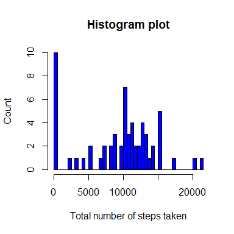
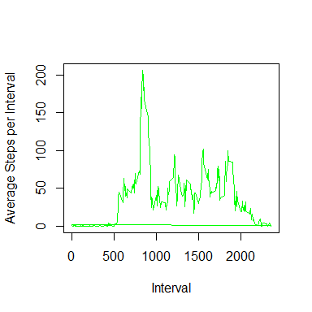
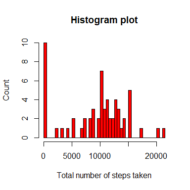
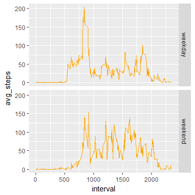

# Reproducible Research: Peer Assessment 1


## Loading and preprocessing the data

Load the required libraries

```r
library(knitr)
library(ggplot2)
library(dplyr)
```

```
## 
## Attaching package: 'dplyr'
```

```
## The following objects are masked from 'package:stats':
## 
##     filter, lag
```

```
## The following objects are masked from 'package:base':
## 
##     intersect, setdiff, setequal, union
```


Set the global options for R Markdown

```r
opts_chunk$set(echo=TRUE,results="asis",fig.height=4,fig.width=4,fig.path = "figure/")
```

1. Load the data

```r
unzip("activity.zip")
activity = read.csv("activity.csv")
```

2. Process/transform the data into a format suitable for analysis

```r
# Converting the date from character format to Date format for easy processing
activity$date = as.Date(activity$date)
```

## What is mean total number of steps taken per day?
1. Calculate the total number of steps taken per day

```r
total_steps_per_day = activity %>% select(c(steps,date)) %>% group_by(date) %>% mutate(total_steps = sum(steps,na.rm=T))
total_steps_per_day = total_steps_per_day[!duplicated(total_steps_per_day$date),-1]
kable(head(total_steps_per_day),format = "markdown")
```


|date       | total_steps|
|:----------|-----------:|
|2012-10-01 |           0|
|2012-10-02 |         126|
|2012-10-03 |       11352|
|2012-10-04 |       12116|
|2012-10-05 |       13294|
|2012-10-06 |       15420|

2. Make a histogram of the total number of steps taken each day

```r
hist(total_steps_per_day$total_steps,xlab = "Total number of steps taken", ylab="Count",breaks = 50,col="blue",main = "Histogram plot")
```

<!-- -->

3. Calculate and report the mean and median of the total number of steps taken per day

```r
mean_total_steps = mean(total_steps_per_day$total_steps)
median_total_steps = median(total_steps_per_day$total_steps)
```

Mean of the total number of steps taken per day is 9354.2295082. Median of the total number of steps taken per day is 10395.

## What is the average daily activity pattern?
1. Make a time series plot (i.e. type = "l") of the 5-minute interval (x-axis) and the average number of steps taken, averaged across all days (y-axis)

```r
avg_steps_per_interval = activity %>% group_by(interval) %>% mutate(avg_steps = mean(steps,na.rm=T))
avg_steps_per_interval = avg_steps_per_interval[,c(3,4)]
kable(head(avg_steps_per_interval),format="markdown")
```


| interval| avg_steps|
|--------:|---------:|
|        0| 1.7169811|
|        5| 0.3396226|
|       10| 0.1320755|
|       15| 0.1509434|
|       20| 0.0754717|
|       25| 2.0943396|

```r
plot(avg_steps_per_interval$interval,avg_steps_per_interval$avg_steps,type="l",xlab="Interval", ylab="Average Steps per Interval",col="green")
```

<!-- -->

2. Which 5-minute interval, on average across all the days in the dataset, contains the maximum number of steps?

```r
max_steps = avg_steps_per_interval$interval[which.max(avg_steps_per_interval$avg_steps)]
```
On average across all the days, 835 5-minute interval contains the maximum number of steps

## Imputing missing values
1. Calculate and report the total number of missing values in the dataset (i.e. the total number of rows with NAs)

```r
total_missing_values = sum(is.na(activity$steps))
```
There are 2304 missing values in the dataset.


2. Devise a strategy for filling in all of the missing values in the dataset.

```r
# To impute missing values, I am using the mean for that day
```

3. Create a new dataset that is equal to the original dataset but with the missing data filled in.

```r
# Creating another variable for imputing steps value
activity$steps_new = activity$steps

for(i in 1:nrow(activity)){
  if(is.na(activity$steps[i])){
    dates = as.Date(activity$date[i])
    activity$steps_new[i] = round(total_steps_per_day$total_steps[total_steps_per_day$date == dates]/288,2)
  }
}

# Check the summary statistics of the variable before imputing values
summary(activity$steps)
```

   Min. 1st Qu.  Median    Mean 3rd Qu.    Max.    NA's 
   0.00    0.00    0.00   37.38   12.00  806.00    2304 

```r
# Check the summary statistics of the variable after imputing values
summary(activity$steps_new)
```

   Min. 1st Qu.  Median    Mean 3rd Qu.    Max. 
   0.00    0.00    0.00   32.48    0.00  806.00 

```r
# Creating another dataset by removing old steps variable and renaming the columns
activity2 = activity[,-1]
str(activity2)
```

'data.frame':	17568 obs. of  3 variables:
 $ date     : Date, format: "2012-10-01" "2012-10-01" ...
 $ interval : int  0 5 10 15 20 25 30 35 40 45 ...
 $ steps_new: num  0 0 0 0 0 0 0 0 0 0 ...

```r
names(activity2) = c("date","interval","steps")
```

4. Make a histogram of the total number of steps taken each day and Calculate and report the mean and median total number of steps taken per day. Do these values differ from the estimates from the first part of the assignment? What is the impact of imputing missing data on the estimates of the total daily number of steps?

```r
# Creating data again for total number of steps taken each day
# This is because now we have imputed steps value in the dataset
total_steps_per_day2 = activity2 %>% select(c(steps,date)) %>% group_by(date) %>% mutate(total_steps = sum(steps))
total_steps_per_day2 = total_steps_per_day2[!duplicated(total_steps_per_day2$date),-1]

hist(total_steps_per_day2$total_steps,xlab = "Total number of steps taken", ylab="Count",breaks = 50,col="red",main = "Histogram plot")
```

<!-- -->

```r
mean_total_steps = mean(total_steps_per_day2$total_steps)
median_total_steps = median(total_steps_per_day2$total_steps)
```
Mean of the total number of steps taken per day is 9354.2295082. Median of the total number of steps taken per day is 1.0395\times 10^{4}.

## Are there differences in activity patterns between weekdays and weekends?

1. Create a new factor variable in the dataset with two levels - "weekday" and "weekend" indicating whether a given date is a weekday or weekend day.

```r
activity2$day = ifelse(weekdays(activity2$date) %in% c("Saturday","Sunday"), "weekend", "weekday")
table(activity2$day)
```


weekday weekend 
  12960    4608 

2. Make a panel plot containing a time series plot (i.e. type = "l") of the 5-minute interval (x-axis) and the average number of steps taken, averaged across all weekday days or weekend days (y-axis)

```r
avg_steps_by_day = activity2 %>% group_by(day,interval) %>% summarise(avg_steps = mean(steps,na.rm=T))
ggplot(data=avg_steps_by_day,aes(interval,avg_steps)) + geom_line(color="orange") + facet_grid(day ~ .)
```

<!-- -->
